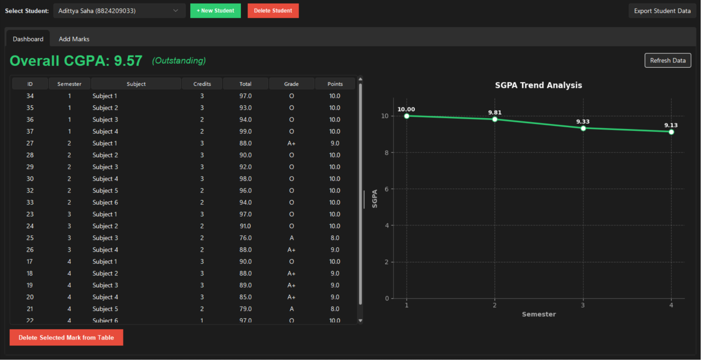

# 🎓 GradeSync - Advanced CGPA & Marks Tracker


GradeSync is a sleek, professional desktop application built with Python and Tkinter, designed to help students track their academic performance across multiple semesters. It features a modern dark-mode aesthetic, dynamic data visualizations, and a robust relational database backend.

## ✨ Features

- **Modern Dark UI**: A professional, animated dark theme built using `sv_ttk` with custom red/green color-coded action buttons.
- **Relational Database**: Powered by MySQL, featuring normalized tables for Students, Semesters, Subjects, and Marks.
- **Dynamic SGPA/CGPA Calculation**: Automatically calculates your SGPA for each semester and your overall CGPA based on standard grade point mapping (O=10, A+=9, A=8, B+=7, B=6, C=5, F=0).
- **Interactive Analytics**: Features an integrated Matplotlib dashboard that dynamically plots your SGPA trend over time, color-coded based on your performance (Green = Excellent, Yellow = Average, Red = Needs Improvement).
- **Excel Export**: Export a student's entire academic history, including all subjects, grades, and cumulative GPAs, directly into a formatted Excel spreadsheet with a single click.

## 🚀 Installation & Setup

### Prerequisites
- Python 3.8 or higher
- MySQL Server installed and running locally

### 1. Clone the Repository
```bash
git clone https://github.com/yourusername/cgpa-tracker.git
cd cgpa-tracker
```

### 2. Install Dependencies
```bash
pip install -r requirements.txt
```

### 3. Database Configuration
Ensure your local MySQL server is running. Open `config.py` and update the credentials to match your MySQL setup:
```python
DB_CONFIG = {
    "host": "localhost",
    "user": "root",
    "password": "your_password",  # Update this!
    "database": "cgpa_tracker_v2",
    "port": 3306
}
```
*Note: The application will automatically create the database and all necessary tables upon first launch!*

### 4. Run the Application
```bash
python main.py
```

## 🛠️ Tech Stack
- **Frontend**: Python `tkinter` with `sv_ttk` (Sun Valley Theme)
- **Backend/Storage**: `mysql-connector-python`
- **Data Analytics**: `pandas`, `matplotlib`
- **Exports**: `openpyxl`

## 📸 Screenshots
### Dashboard


### Add Marks


### Analytics


## 🤝 Contributing
Contributions, issues, and feature requests are welcome!

## 📝 License
This project is open source and available under the [MIT License](LICENSE).
